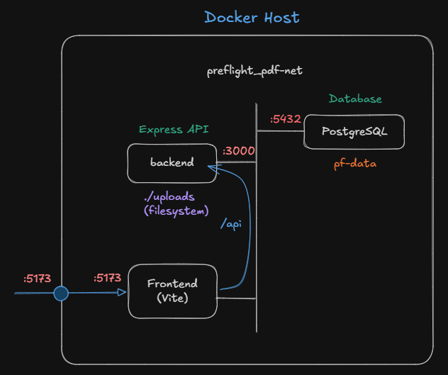
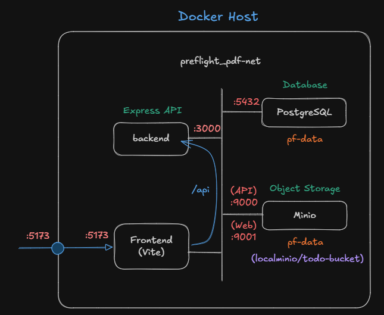

# File Storage Tutorial

This is a `File Storage Tutorial` for the `Backend Architecture` module.
We will continue from the []() project.

---

## Content

- Project reviewing
- Project restructuring
- Using file system as file storage
- Using Object storage as file storage

---

## Project Setup

Clone the []() project.

```bash
pnpm install
pnpm approve-builds
```

This tutorial also requires a `PostgreSQL` database. We can use the [pf-db](https://github.com/fullstack-69/pf-db.git) project.

---

## Project Reviewing

- Folders:
  - `./src` contains `index.ts` which defines all API endpoints.
  - `./db` stores database schemas, encryption logic, and other database utilities.
- API Endpoints:
  - `/todo` endpoints handle CRUD operations on `todo` items and their `task`.
  - `/user` endpoints handle CRUD operations on `user` data.

---

## Project Restructuring

We will create the following folders and restructure API endpoint codes

- `./src/routes` stores logic for all endpoints.
  - [`todoRouter.ts`](https://github.com/26x497-FSD-staff/tutorial-db-2569/blob/minio/src/routes/todoRouter.ts) contains codes of all `/todo/...`
  - [`userRouter.ts`](https://github.com/26x497-FSD-staff/tutorial-db-2569/blob/minio/src/routes/userRouter.ts) contains codes for all `/user/...`
- `./src/middlewares` stores logic for all middlewares.
  - [`jsonErrorHandler.ts`](https://github.com/26x497-FSD-staff/tutorial-db-2569/blob/minio/src/middlewares/jsonErrorHandler.ts) contains codes of the `jsonError` middleware

After restructuring the code, `./src/index.ts` is left with the following code.

```typescript
import "dotenv/config";

// import middlewares
import cors from "cors";
import Debug from "debug";
import express from "express";
import helmet from "helmet";
import morgan from "morgan";
import { jsonErrorHandler } from "./middlewares/jsonErrorHandler.ts";

// import routers
import todoRouter from "./routes/todoRouter.ts";
import userRouter from "./routes/userRouter.ts";

import { todo } from "node:test";
const debug = Debug("pf-backend");

//Intializing the express app
const app = express();

//Middleware
app.use(morgan("dev", { immediate: false }));
app.use(helmet());
app.use(
  cors({
    origin: false, // Disable CORS
    // origin: "*", // Allow all origins
  }),
);
// Extracts the entire body portion of an incoming request stream and exposes it on req.body.
app.use(express.json());

// use routers
app.use("/todo", todoRouter);
app.use("/user", userRouter);

// use jsonErrorHandler middleware
app.use(jsonErrorHandler);

// Running app
const PORT = process.env.PORT || 3000;
// * Running app
app.listen(PORT, async () => {
  debug(`Listening on port ${PORT}: http://localhost:${PORT}`);
});
```

---

## Using File System as file storage

In this section, we will create API endpoints to handle file upload and store them on backend's `uploads` folder.



### 1. Create `fileTable` in the database

When a file is uploaded, we will add a new record in the database. We need to create a new table to hold those file upload records.

Insert the `fileTable` scheme in the file `./db/schema.ts` as following.

```typescript
// Define the FILE table
export const fileTable = pgTable("file", {
  id: uuid("id").primaryKey().defaultRandom(),
  filename: varchar("filename", { length: 255 }).notNull(),
  itemId: uuid("item_id").notNull(), // ref to a todo or a task item
  createdAt: timestamp("created_at").defaultNow().notNull(),
  updatedAt: timestamp("updated_at", { mode: "date", precision: 3 }).$onUpdate(
    () => new Date(),
  ),
});
```

Apple the updated schema to the database.

```bash
pnpm run db:push
```

We should be able to see a new `file` table in the database.

### 2. Install `multer` package

To make our API supports **file upload**, we will use [multer](https://www.npmjs.com/package/multer) package,

`Multer` is a Node.js middleware for handling `multipart/form-data`, which is primarily used for uploading files.

```bash
pnpm i multer
pnpm i -D @types/multer
```

### 3. Initialize Multer Middleware

Create the file `./src/routes/fileRouter_v1.ts` with the following code to intilize Express's `router` and `multer`.

```typescript
// ./src/routes/fileRouter_v1.ts

import express, {
  Router,
  type Request,
  type Response,
  type NextFunction,
} from "express";
import multer from "multer";
import path from "path";
import fs from "fs";

const router = Router();

// Ensure the upload directory exists locally
const uploadDir = path.join(process.cwd(), "uploads");
if (!fs.existsSync(uploadDir)) {
  fs.mkdirSync(uploadDir);
}

// 1. Configure Multer Disk Storage
const storage = multer.diskStorage({
  destination: (req, file, cb) => {
    cb(null, uploadDir);
  },
  filename: (req, file, cb) => {
    // Generate a unique timestamped file name
    const uniqueSuffix = Date.now() + "-" + Math.round(Math.random() * 1e9);
    const ext = path.extname(file.originalname);
    cb(null, file.fieldname + "-" + uniqueSuffix + ext);
  },
});

// 2. Filter files to allow only images
const fileFilter = (
  req: Request,
  file: Express.Multer.File,
  cb: multer.FileFilterCallback,
) => {
  if (
    file.mimetype.startsWith("image/") ||
    file.mimetype.startsWith("application/pdf")
  ) {
    cb(null, true);
  } else {
    cb(new Error("Only image and pdf files are allowed!"));
  }
};

const upload = multer({ storage, fileFilter });

// Insert endpoints' logic below

// Global Error Handler for handling Multer/Upload issues
router.use((err: any, req: Request, res: Response, next: NextFunction) => {
  res.status(400).json({ error: err.message });
});

export default router;
```

We can `use` the new router in the `./src/index.ts` as following.

```typescript
// ./src/index.ts

// import routers
import fileRouter_v1 from "./routes/fileRouter_v1.ts";

...

// use routers
app.use('/todo',todoRouter);
app.use('/user',userRouter);
app.use('/file',fileRouter_v1);   // add this line

...
```

After this our API will provide `/file/...` endpoints.

### 4. `POST /file/upload` endpoint

Insert the following code in the file `./src/routes/fileRouter_v1.ts`. This endpoint will be used to handle a file uploading operation.

```typescript
// POST /file/upload - Endpoint to handle file upload
router.post(
  "/upload",
  upload.single("file"),
  async (req: Request, res: Response) => {
    if (!req.file) {
      return res
        .status(400)
        .json({ error: "Please select an image file to upload." });
    }

    const itemId = req.body.itemId;
    const filename = req.file.filename;

    // add filename to fileTable
    const result = await dbClient
      .insert(fileTable)
      .values({
        filename,
        itemId,
      })
      .returning({ id: fileTable.id, itemId: fileTable.itemId });

    // Construct a public view URL for the client
    const fileUrl = `${req.protocol}://${req.get("host")}/file/view/${filename}`;

    res.status(201).json({
      message: "Image uploaded successfully!",
      id: result[0].id,
      itemId: result[0].itemId,
      filename: filename,
      size: req.file.size,
      url: fileUrl,
    });
  },
);
```

This endpoint takes in `file` and `itemId` (todoId or taskId) as input.

We can use \*_Insomnia_ to test this endpoint by providing `Multipart/form-data` in the request body as following.

- In the `Body` section, choose `Form Data`.
- `file` : choose file to upload
- `itemId` : which `todo` or `task` item that the file will be attached.

Note that the endpoint return `fileUrl` as part of its response. For example, it could be `http://localhost/file/view/:filename`.

```json
// example of response from POST /file/upload
{
  "message": "Image uploaded successfully!",
  "id": "21851af5-3ad2-483e-a7a1-ad42fff7feda",
  "itemId": "ce0d2266-ff88-4fe3-8fa5-1a382e3342bd",
  "filename": "file-1785298205990-943539974.png",
  "size": 240858,
  "url": "http://localhost:3001/file/view/file-1785298205990-943539974.png"
}
```

### 5. `GET /file/view/:filename` endpoint

This endpoint provide access to an uploaded file which is stored in the `uploads` folder on the backend.

```typescript
// Serve the "uploads" folder statically so users can view file
// GET /file/view/:filename - Endpoint to access specific file
router.use("/view", express.static(uploadDir));
```

It serves the `uploads` folder statically by the `express.static()` middleware.

Now we should be able to view the uploaded file using `url`.

### 6. `GET /file` endpoint

This endpoint return a list of all uploaded files stored in the `uploads` folder

```typescript
// GET /file - Endpoint to list all files
router.get("/", (req: Request, res: Response): void => {
  fs.readdir(uploadDir, (err, files) => {
    if (err) {
      res.status(500).json({ error: "Unable to scan directory structure" });
      return;
    }

    // Map files to include complete metadata and functional access URLs
    const fileList = files
      .map((file) => {
        const filePath = path.join(uploadDir, file);
        let stats;

        try {
          stats = fs.statSync(filePath);
        } catch (statErr) {
          return null; // Skip file if metadata reading fails
        }

        return {
          filename: file,
          url: `${req.protocol}://${req.get("host")}/file/view/${file}`,
          size: stats.size,
          createdAt: stats.birthtime,
        };
      })
      .filter(Boolean); // Filter out any null entries

    res.status(200).json({
      totalFiles: fileList.length,
      files: fileList,
    });
  });
});
```

Note that we does not include the logic to get file records from the `fileTable`. The response would be similar to this.

```json
{
  "totalFiles": 1,
  "files": [
    {
      "filename": "image-1785296417555-718238840.png",
      "url": "http://localhost:3001/file/view/image-1785296417555-718238840.png",
      "size": 44601,
      "createdAt": "2026-07-29T03:40:17.551Z"
    }
  ]
}
```

In this case, there is only one uploaded file.

### 7. `DELETE /file/:filename` endpoing

This endpoint gets `:filename` to be deleted as parameterized URL.

```typescript
// DELETE /file/:filename - Endpoint to delete a specific file by name
router.delete("/", (req: Request, res: Response): void => {
  const filename = req.query.filename as string;

  if (!filename) {
    res
      .status(400)
      .json({ error: "Filename parameter is required in the body" });
    return;
  }

  // Security check: Prevent directory traversal attacks (e.g., "../../etc/passwd")
  const safeFilename = path.basename(filename);
  const filePath = path.join(uploadDir, safeFilename);

  // Verify file path belongs to the directory and exists
  if (!fs.existsSync(filePath)) {
    res.status(404).json({ error: "File not found" });
    return;
  }

  fs.unlink(filePath, (err) => {
    if (err) {
      res.status(500).json({ error: "Failed to delete file" });
      return;
    }
    res
      .status(200)
      .json({ message: `File ${safeFilename} deleted successfully` });
  });
});
```

Note that we does not include the logic to remove a file record from `fileTable`.

### 8. `POST /file/reset` endpoint

Finally, we will create an endpoint for deleting all upload files.

```typescript
// POST Endpoint to delete ALL files in the directory
router.post("/reset", (req: Request, res: Response): void => {
  fs.readdir(uploadDir, (err, files) => {
    if (err) {
      res.status(500).json({ error: "Failed to read directory" });
      return;
    }

    if (files.length === 0) {
      res.status(200).json({ message: "Directory is already empty" });
      return;
    }

    // Map files to absolute paths
    const deletionPromises = files.map((file) => {
      return new Promise<void>((resolve, reject) => {
        fs.unlink(path.join(uploadDir, file), (unlinkErr) => {
          if (unlinkErr) reject(unlinkErr);
          else resolve();
        });
      });
    });

    // Execute all deletions concurrently
    Promise.all(deletionPromises)
      .then(() => {
        res.status(200).json({
          message: "All files deleted successfully",
          count: files.length,
        });
      })
      .catch((error) => {
        res.status(500).json({ error: "Failed to delete some files cleanly" });
      });
  });
});
```

Note that we does not include the logic to remove all file records from `fileTable`.

---

## Using Object Storage as file storage

In this section, we will create API endpoints that store uploaded files in an **Object Data Store** service.



### 1. Install `minio` package

[MinIO](https://www.min.io/product/aistor/object-data-store) is an Amazon S3 compatible **Object Data Store** service that we will use for file storage. For JavaScript/TypeScript project, we need the `minio` package.

```bash
pnpm i minio
```

### 2. Create MinIO docker container

Create a `docker-compose` file, `./compose-minio.yml` with the following code.

```yaml
services:
  minio:
    image: quay.io/minio/minio:latest
    container_name: minio-server
    ports:
      - ${MINIO_API_PORT}:9000 # S3 API Port
      - ${MINIO_CONSOLE_PORT}:9001 # Web Console Port
    environment:
      MINIO_ROOT_USER: ${MINIO_ROOT_USER}
      MINIO_ROOT_PASSWORD: ${MINIO_ROOT_PASSWORD}
    volumes:
      - minio_data:/data
    command: server --console-address ":${MINIO_CONSOLE_PORT}" /data
    healthcheck:
      test: ["CMD", "mc", "ready", "local"]
      interval: 5s
      timeout: 5s
      retries: 5
    networks:
      - preflight_pf-net

volumes:
  minio_data:
networks:
  preflight_pf-net:
    external: true
```

Next, edit MinIO environment variables in `.env` file.

```
// .env file
# Minio
MINIO_ENDPOINT=localhost
MINIO_ROOT_USER=minioadmin
MINIO_ROOT_PASSWORD=minio1234
MINIO_API_PORT=9000
MINIO_CONSOLE_PORT=9001
MINIO_BUCKET=todo-bucket
MINIO_USE_SSL=false
MINIO_ACCESS_KEY=...
MINIO_SECRET_KEY=...
```

Start a Minio container with the following command.

```bash
docker compose -f compose-minio.yml up -d
```

This creates the `minio-server` container that connects the same docker network, `preflight_pf-net`.

Now we should be able to access MinIO's management console at `http://localhost:9001`.

If we want to stop and remove the container, use the following command.

```bash
docker compose -f compose-minio.yml down [-v]
```

### 3. MinIO Configuration

To configure MinIO, We need to run a few commands inside the `minio-server` container. In order to do that we must gain access to the container's shell (`/bin/sh`).

```bash
docker exec -it minio-server /bin/sh
sh-5.1# ...
```

To allow MinIO API access, we need to create MinIO `alias`. An `alias` is a reference name for resource management.

```bash
sh-5.1# mc alias set localminio http://localhost:9000 minioadmin minio1234
Added `localminio` successfully.
```

Checks the result by using the following command.

```bash
sh-5.1# mc alias ls
localminio
  URL       : http://localhost:9000
  AccessKey : minioadmin
  SecretKey : minio1234
  API       : s3v4
  Path      : auto
  Src       : /tmp/.mc/config.json
```

Next, we generate a new `access/secret` key pair for using with our backend API.

```bash
sh-5.1# mc admin accesskey create --name todoapp localminio minioadmin
Access Key: 1S7G2CJKLL6P1VG2PCZZ
Secret Key: fjsWuXDAoisfqU8vfZvoh4zFXnrHMtrjtRBQR7XE
Expiration: NONE
Name: todoapp
Description:
```

Note that the `secret key` value will be diplayed only at this time. We must make a copy of both keys and set them in `.env`.

```
...
MINIO_ACCESS_KEY=1S7G2CJKLL6P1VG2PCZZ
MINIO_SECRET_KEY=fjsWuXDAoisfqU8vfZvoh4zFXnrHMtrjtRBQR7XE
```

To list all `access key` previously created, run the following command.

```bash
sh-5.1# mc admin accesskey ls localminio
User: minioadmin
  Access Keys:
    387VS91F9BIIPFVEDCG6, expires: never, sts: false
    XDYKSU1YGXWLU9JAZM1G, expires: never, sts: false
```

Finally, we must create a bucket, `todo-bucket`, under our `localminio` alias with the following command.

```bash
sh-5.1# mc mb localminio/todo-app
Bucket created successfully `localminio/todo-app`.
```

Verify the new bucket with this command.

```bash
sh-5.1# mc ls localminio
[2026-07-29 07:30:58 UTC]     0B todo-bucket/
```

### 4. Create MinIO Client

Now we can create MinIO client object in the file `./minio/minioClient.ts` using this code.

```typescript
// ./minio/minioClient.ts
import * as Minio from "minio";
import dotenv from "dotenv";

dotenv.config();

export const minioClient = new Minio.Client({
  endPoint: process.env.MINIO_ENDPOINT || "localhost",
  port: parseInt(process.env.MINIO_API_PORT || "9000"),
  useSSL: false,
  accessKey: process.env.MINIO_ACCESS_KEY || "minioadmin",
  secretKey: process.env.MINIO_SECRET_KEY || "miniopassword",
});

export const BUCKET_NAME = process.env.MINIO_BUCKET || "my-app";

// Automatically ensure the bucket exists on application startup
export const initMinIO = async () => {
  try {
    const exists = await minioClient.bucketExists(BUCKET_NAME);
    if (!exists) {
      await minioClient.makeBucket(BUCKET_NAME, "us-east-1");
      console.log(`Bucket "${BUCKET_NAME}" created successfully.`);
    }
    console.log(`Successfully connects to Minio bucket "${BUCKET_NAME}"`);
  } catch (err) {
    console.log(`Unable to connect to Minio`);
  }
};
```

---

## Using Minio client with API endpoints

Create the file `./src/routes/fileRouter_v2.ts` with the following code.

```typescript
import express, {
  Router,
  type Request,
  type Response,
  type NextFunction,
} from "express";
import {
  minioClient,
  BUCKET_NAME,
  initMinIO,
} from "../../minio/minioClient.ts";
import * as Minio from "minio";

import multer from "multer";
import path from "path";

import { dbClient } from "@db/client.js";
import { fileTable } from "@db/schema.js";

import dotenv from "dotenv";
dotenv.config();

const router = Router();

// Configure multer to hold files in memory buffers instead of writing to local disk
// memoryStorage() does not support filename pattern configuration.
const storage = multer.memoryStorage();

// Filter files to allow only images
const fileFilter = (
  req: Request,
  file: Express.Multer.File,
  cb: multer.FileFilterCallback,
) => {
  const allowedTypes = /jpeg|jpg|png|webp|pdf/;
  const extname = allowedTypes.test(
    path.extname(file.originalname).toLowerCase(),
  );
  const mimetype = allowedTypes.test(file.mimetype);

  if (extname && mimetype) {
    return cb(null, true);
  }
  cb(
    new Error("Only web image formats (JPEG, PNG, WEBP) and PDF are allowed!"),
  );
};

// Limite file size to 10MB
const fileSize = 10 * 1024 * 1024;

const PORT = process.env.PORT || 3000;

// Configure multer
const upload = multer({
  storage,
  limits: { fileSize: fileSize },
  fileFilter,
});

// Insert endpoints below

// Global Error Handler
router.use((err: Error, req: Request, res: Response, next: NextFunction) => {
  res.status(500).json({ error: err.message || "Internal Server Error" });
});

// Initialize storage configuration and start server
try {
  await initMinIO();
} catch (err) {
  console.error("Failed to initialize MinIO storage client:", err);
}

export default router;
```

We can `use` the new router in the `./src/index.ts` as following.

```typescript
// ./src/index.ts

// import routers
import fileRouter_v2 from "./routes/fileRouter_v2.ts";

...

// use routers
app.use('/todo',todoRouter);
app.use('/user',userRouter);
app.use('/file',fileRouter_v1);
app.use('/v2/file',fileRouter_v2);   // add this line

...
```

After this our API will provide `/v2/file/...` endpoints.

### 1. `POST /v2/file/upload` endpoint

In the file `./src/routes/fileRouter_v2.ts`, insert code for the endpoint.

```typescript
// POST /v2/file/upload - Endpoint to handle file upload
router.post(
  "/upload",
  upload.single("file"),
  async (req: Request, res: Response): Promise<any> => {
    try {
      if (!req.file) {
        return res
          .status(400)
          .json({ error: "No image or pdf file provided." });
      }

      // Generate a unique object name to prevent file collisions
      const fileExtension = path.extname(req.file.originalname);
      const filename = path.parse(req.file.originalname).name;
      const cleanFilename = filename.replace(/\s+/g, "_").toLowerCase();
      // console.log(cleanFilename);

      // use itemId as a folder to store the object
      const itemId = req.body.itemId;
      const objectName = `${itemId}/${cleanFilename}-${Date.now()}-${Math.random().toString(36).substring(2, 9)}${fileExtension}`;

      // Upload buffer data directly to MinIO
      await minioClient.putObject(
        BUCKET_NAME,
        objectName,
        req.file.buffer,
        req.file.size,
        {
          // metadata for rendering
          "Content-Type": req.file.mimetype,
          itemId: itemId,
        },
      );

      // add filename to file table
      const result = await dbClient
        .insert(fileTable)
        .values({
          filename: objectName,
          itemId: itemId,
        })
        .returning({ id: fileTable.id, itemId: fileTable.itemId });

      return res.status(201).json({
        message: "Image uploaded successfully",
        id: result[0].id,
        itemId: result[0].itemId,
        fileName: objectName,
        viewUrl: `http://localhost:${PORT}/v2/file/view/${encodeURIComponent(objectName)}`,
      });
    } catch (error) {
      console.error("Upload error:", error);
      return res.status(500).json({ error: "Failed to upload image." });
    }
  },
);
```

Similary, this endpoint takes in `file` and `itemId` (todoId or taskId) as input.

```json
// Example of response from POST /v2/file/upload
{
  "message": "Image uploaded successfully",
  "id": "990c747a-c036-45ba-ae4c-09e2beea4a91",
  "itemId": "ce0d2266-ff88-4fe3-8fa5-1a382e3342bd",
  "fileName": "ce0d2266-ff88-4fe3-8fa5-1a382e3342bd/screenshot_2025-06-27_094757-1785315883979-2oszi19.png",
  "viewUrl": "http://localhost:3001/v2/file/view/ce0d2266-ff88-4fe3-8fa5-1a382e3342bd%2Fscreenshot_2025-06-27_094757-1785315883979-2oszi19.png"
}
```

The uploaded file will be put in the `todo-bucket` with an `objectName` of the pattern `<itemId>/<cleanFilename>-<Date()>-<randome-string>.<ext>`.

Since the `objectName` may contain `/` symbol, we must encode it as valid `URL`. The URL is encoded with the `encodeURIComponent()` function.

### 2. `GET /v2/file/view/:filename` endpoint

This endpoint provide access to an uploaded file stored in `MinIO`.

```typescript
// GET /v2/file/view/:filename - Endpoint to access file (Streams object safely from storage)
router.get(
  "/view/:filename",
  async (req: Request, res: Response, next: NextFunction): Promise<void> => {
    try {
      const filename = req.params.filename as string;

      // Fetch object metadata to get the original content type
      const stat = await minioClient.statObject(BUCKET_NAME, filename);
      res.setHeader("Content-Type", stat.metaData["content-type"]);

      // Stream the image file directly to the client response
      const dataStream = await minioClient.getObject(BUCKET_NAME, filename);
      dataStream.pipe(res);
    } catch (error: any) {
      if (error.code === "NoSuchKey") {
        res.status(404).json({ error: "File not found." });
        return;
      }
      next(error);
    }
  },
);
```

Now we should be able to view the uploaded file using `viewUrl`.

### 3. `GET /v2/file/` endpoint

This endpoint return a list of uploaded files identified by query parameters `prefix` and `suffix`.

```typescript
// GET /v2/file?prefix=xxx&suffix=yyy - Endpoint to list files
router.get("/", (req: Request, res: Response, next: NextFunction): void => {
  try {
    // Optional: filter by virtual folder path (e.g., /list?prefix=avatars/)
    const prefix = (req.query.prefix as string) || ""; // folder in a bucket
    const suffix = (req.query.suffix as string) || ""; // e.g., "png" or "pdf"

    // Create an object stream from MinIO
    // Set recursive to true to list items inside subdirectories
    const stream = minioClient.listObjectsV2(BUCKET_NAME, prefix, true);

    const objects: Minio.BucketItem[] = [];

    // Collect stream data chunks into an array
    stream.on("data", (obj) => {
      // filter by suffix (.png, .pdf)
      if (
        obj.name &&
        obj.name.toLowerCase().endsWith(`.${suffix.toLowerCase()}`)
      ) {
        objects.push(obj);
      } else if (!suffix) {
        objects.push(obj);
      }
    });

    // Handle stream conclusion and return data
    stream.on("end", () => {
      res.status(200).json({
        count: objects.length,
        prefix: prefix || null,
        files: objects.map((file) => ({
          name: file.name,
          size: file.size,
          lastModified: file.lastModified,
          etag: file.etag,
        })),
      });
    });

    // Handle internal stream connection errors
    stream.on("error", (err) => {
      next(err);
    });
  } catch (error) {
    next(error);
  }
});
```

### 4. `DELETE /v2/file/folder/*filePath` endpoint

This endpoint handles object deletion.

```typescript
// DELETE /v2/file/folder/*filePath - Endpoint to delete an file
router.delete(
  "/folder/*filePath",
  async (req: Request, res: Response, next: NextFunction): Promise<void> => {
    try {
      // Example URL: /v2/file/folder/xxxxx/image.png
      // Result: req.params.filePath = ['xxxxx', 'image.png']
      const filePath = req.params.filePath;
      console.log(filePath);

      if (!filePath || filePath.length === 0) {
        res.status(400).json({ error: "No file path provided." });
        return;
      }

      // Re-combine segments with forward slashes for MinIO
      const fullStoragePath = Array.isArray(filePath)
        ? filePath.join("/")
        : filePath; // Fallback if parsed as a string in certain setups

      console.log(fullStoragePath);

      // Check if the object exists before attempting deletion
      try {
        await minioClient.statObject(BUCKET_NAME, fullStoragePath);
      } catch (statError: any) {
        res.status(404).json({
          msg: "File not found in storage.",
          error: statError,
        });
        return;
        throw statError; // Pass any other internal MinIO errors down
      }

      // Delete the object from the MinIO bucket
      await minioClient.removeObject(BUCKET_NAME, fullStoragePath);

      // Return successful response
      res.status(200).json({
        message: "Image deleted successfully",
        filename: fullStoragePath,
      });
    } catch (error) {
      next(error); // Forwards to your global error handler
    }
  },
);
```

The `/*filePath` parameter is crucial because the `objectName` contains `/` symbol. This must be translated into `folder/filename`.
